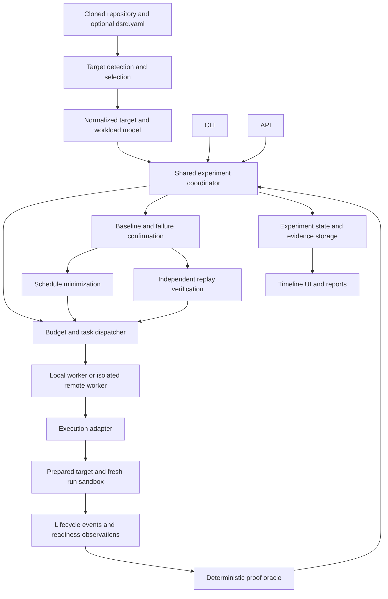
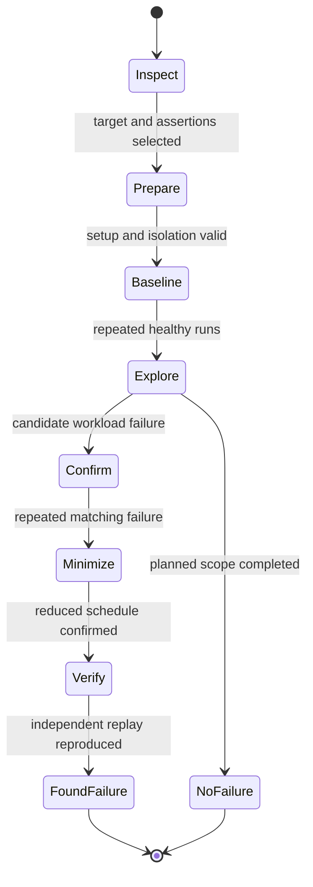

# Portable and Scalable DSRD Architecture

Date: 2026-09-12

Status: proposed architecture; the contracts, commands, and modules below are implementation targets, not current capabilities.

## 1. Objective and support boundary

Make a cloned application usable by DSRD through automatic target discovery or a small explicit configuration, then increase experiment throughput without weakening evidence or replay.

The invariant remains:

```text
discover -> execute -> observe -> confirm -> minimize -> replay -> verified artifact -> timeline
```

The discover -> minimize -> replay pipeline in `AGENTS.md` and `docs/plan.md` remains fixed. This design extends the generic workload design and the reliable Compose repair design. It changes the proposed placement of outcome classifications, dependency handling during perturbation, and future artifact versioning described in the older design; those changes must be reconciled during the public-contract migration before implementation.

"Any repository" means any runnable target supported by an installed adapter, with its documented setup available and a meaningful success/failure contract. It does not mean arbitrary source code can be launched or judged correctly without knowing how it runs.

| Repository situation | Required behavior |
| --- | --- |
| Compose application with declared health checks and jobs | Discover and normalize the target; proceed after successful preparation and baselines. |
| Compose application with insufficient success evidence | Request explicit checks through configuration; return `needs_configuration`. |
| Multiple Compose stacks or monorepo applications | List target candidates; require an unambiguous selection. |
| Application without Compose | Use an explicit local-process manifest or another supported adapter. |
| Missing secrets, images, tools, environment files, or external services | Report setup diagnostics; do not create a race artifact. |
| Library, documentation repository, unsupported orchestrator, or unsupported isolation requirements | Return `unsupported_target` with the missing capability. |
| Healthy target with no reproduced failure inside the budget | Report the explored scope; make no claim that the application is race-free. |

Three independent scalability concerns are addressed: project portability, search cost as workload count grows, and execution capacity across isolated workers. Cloud deployment, accounts, billing, and authentication remain outside this implementation scope.

## 2. Architecture choice

| Approach | Benefit | Cost | Decision |
| --- | --- | --- | --- |
| Generalize only the Compose runner | Shortest route to broad Compose support. | Other runtimes and execution scaling need another boundary later. | Complete Compose first inside the chosen design. |
| Shared engine with capability-based adapters and a local worker protocol | One evidence path across CLI/API, projects, and execution locations. | Requires disciplined shared contracts and isolation. | Chosen; initially one process and one worker. |
| Introduce a distributed service platform immediately | Provides queueing and worker management early. | Adds operational work before portability and evidence are reliable. | Defer deployment; preserve a transport boundary now. |

Start with a modular local application. The coordinator and worker can share a process, but communicate through typed task/result interfaces. A later remote dispatcher replaces the transport, not discovery logic, failure classification, or replay semantics.



The diagram includes feedback: confirmation, minimization, and replay all submit physical runs to the same dispatcher, adapter, and oracle. Artifact publication is permitted only after replay verification.

## 3. Component boundaries and repository mapping

All public DTOs, schemas, and protocol versions live in `packages/contracts`. No package defines a competing `Schedule`, `TimelineEvent`, `RunResult`, or `FailureArtifact`.

| Area | Responsibility | Inputs and outputs | Proposed location |
| --- | --- | --- | --- |
| Target discovery | Scan allowed project paths; detect candidates; merge explicit configuration; report ambiguity. | Repository/configuration -> target candidates and setup requirements. | New `packages/discovery`, introduced with portability work. |
| Experiment coordinator | Own stage transitions, confirmations, budgets, search order, minimization, replay, and artifact publication. | Normalized target/policy and executor -> experiment outcome. | `packages/scheduler/src/engine.ts`; refactor existing `orchestrator.ts`, `search.ts`, and `minimize.ts` behind it. |
| Adapter registry | Select an implementation by target kind, protocol version, and available capabilities. | Target definition -> compatible adapter. | `packages/runtime/src/adapter-registry.ts`; replace duplicated platform selection. |
| Worker execution | Prepare target, allocate run state, apply schedule, observe, cancel, drain commands, and clean owned resources. | Execution task -> physical attempt result. | `packages/runtime/src/worker.ts` and existing runtime adapters. |
| Proof | Evaluate observations and validate failure signatures and ordering constraints with pure deterministic rules. | Observation stream/snapshot and assertions -> verdict/evidence. | `packages/proof`; extend oracle and timeline modules. |
| State/evidence storage | Persist attempts, stage checkpoints, events, and verified artifacts. | Versioned records -> durable records and bounded event pages. | Storage interfaces in contracts; local implementation under scheduler, API store adapted to those interfaces. |
| CLI/API/UI | Select target, supply policy, start/cancel experiments, and present structured results. | Shared engine APIs and progress events. | Existing scheduler CLI, `packages/api`, and `packages/web`. |

CLI and API use the same engine entry points and defaults. The API currently constructs its own candidate grid and the CLI uses adaptive stages; that policy duplication is removed. The UI only renders persisted evidence. Fixture data must be available only in an explicit demo mode.

The coordinator imports no Docker, process-spawn, or Kubernetes implementation code. Worker-side proof may depend on shared normalized observations, but never on whether a task was submitted from CLI, API, search, or replay.

## 4. Repository onboarding and normalized target model

### Detection

`inspect` reads project metadata and discovers candidate launch definitions. Scan the selected repository while excluding dependencies, build output, `.git`, `.worktrees`, and unrelated nested checkouts. Bound scan depth/file count and report truncation. Candidate IDs use repository-relative paths rather than filesystem traversal order.

Discover Compose targets, explicit DSRD/local-process manifests, and supported Kubernetes manifest sets. Package scripts and language/build metadata can suggest configuration, but do not establish independently controlled workloads or success criteria by themselves. Inspection does not execute package scripts or application code.

A `dsrd.yaml` target selection takes precedence over autodetection. An explicit CLI selection takes precedence over that file. Ambiguous file combinations, profiles, job types, and probe semantics are reported rather than guessed.

### Normalization

The chosen adapter resolves the launch definition into a versioned `TargetDefinition` and `WorkloadModel`. Compose normalization uses its own canonical configuration resolution, including selected file order, environment-file references, and profiles; keep resolved secret values out of public metadata. Docker documents that `compose config` merges files, resolves variables, and expands notation: [canonical Compose configuration](https://docs.docker.com/reference/cli/docker/compose/config/).

The normalized model includes:

- Target kind, repository-relative launch paths, project root, selected profiles, and adapter version.
- Stable workload IDs, workload kind, replica policy, expected terminal outcomes, and readiness assertions.
- Dependency edges with their condition and provenance: declared, explicitly configured, or observed.
- Native dependency semantics, including health and successful-job-completion gates. Unsupported lifecycle relationships block execution until supported or explicitly configured.
- Advertised perturbation mechanisms for each workload/phase and their requirements.
- Mutable state, external endpoints/resources, reset strategy, and isolation limitations.
- Fingerprints of the non-secret source/configuration, assertions, schedule policy, and execution environment class.

Observed or inferred edges can prioritize search. They cannot establish a declared guarantee or decide failure. If an LLM suggests a launch command or probe, it remains a configuration suggestion; execution and classification use validated deterministic inputs.

### Configuration example

This is the proposed schema shape. It must be implemented and validated centrally before the commands below are shipped.

```yaml
version: 1
target:
  platform: compose
  files: [compose.yaml, compose.dev.yaml]
  envFiles: [.env.local]
  profiles: []
workloads:
  migrate:
    kind: job
    expectedExitCodes: [0]
  api:
    readiness:
      type: http
      target: http://api:3000/health
      expectedStatus: 200
      observerLocation: target-network
state:
  reset: fresh-owned-state
experiment:
  dependencyPolicy: declared
  baselineRuns: 3
  confirmationRuns: 3
  replayRuns: 3
  maxExecutions: 50
  maxInFlight: 1
  delayOptionsMs: [0, 500, 1000, 2000, 3000]
  timeouts:
    preflightMs: 300000
    runMs: 60000
    readinessMs: 30000
    cleanupMs: 30000
```

Existing native health checks are reused unless configuration explicitly replaces them. Probes run where their addresses are meaningful; target-network addresses are not assumed reachable from the host. TCP acceptance proves a listening port, not application-level readiness; the configured assertion defines the required meaning.

One workload ID controls one native lifecycle group. The first Compose implementation rejects multiple replicas unless the adapter defines how schedule application and evidence aggregate across every replica. Do not silently observe only one container.

## 5. Shared contracts and identity

The existing perturbation-based `Schedule` payload remains intact: workload ID, phase, and delay. Extend surrounding shared contracts in a coordinated migration rather than partially changing consumer packages.

| Contract | Required fields/meaning |
| --- | --- |
| `ProjectSnapshot` | Immutable snapshot ID, repository-relative input paths, public source/configuration fingerprints, Git revision when available, and explicit dirty-source identity. Git is optional for a local target. |
| `TargetDefinition` | Adapter kind/version, selected native configuration, reference to source snapshot, and setup references without secret values. |
| `WorkloadModel` | Workloads, conditioned/provenanced dependency edges, assertions, supported perturbations, reset/isolation constraints, and model fingerprint. |
| `ExperimentPolicy` | Confirmation counts, search seed/order, dependency policy, reset policy, all deadlines, execution/wall-time budgets, and concurrency/resource limits. |
| `ExecutionTask` | Protocol version, experiment/task/attempt IDs, attempt ordinal, purpose, target/model/policy fingerprints, schedule, environment class, lease token, and deadline. |
| `RunContext` | Worker-local prepared handles, isolated workspace, resource owner ID, monotonic clock origin, cancellation signal, and secret bindings. It is never serialized into an artifact. |
| `RunResult` | Physical attempt status, proof verdict/signature, normalized evidence, applied perturbations with measured timing, diagnostics, cleanup report, and environment fingerprint. |
| `ProgressEvent` | Experiment ID, increasing sequence, stage, unique candidate count, physical execution counts, budget state, and references to persisted evidence. |

Use globally unique experiment/task/attempt IDs. Service names and schedule display IDs are not resource ownership keys.

### Outcome ownership

A single failed run is not yet a proven race. Proof classifies physical observations; the coordinator establishes whether a reproducible difference from a healthy baseline is attributable to a controlled schedule.

```text
Physical RunResult.status:
  healthy | workload_failure | execution_error | inconclusive | cancelled

Experiment outcome:
  found_failure | no_failure | target_unhealthy | execution_error |
  inconclusive | unsupported_target | needs_configuration | cancelled

Replay outcome:
  reproduced | not_reproduced | execution_error | inconclusive | cancelled
```

`found_failure` carries a confirmed race classification plus its experiment mode and evidence. A workload failure on the empty baseline becomes `target_unhealthy`. Mixed outcomes become `inconclusive`. An adapter failure remains `execution_error`. This replaces the older proposal to label an individual oracle result `race_failure` before baseline comparison; update that proposal and every consumer during migration.

Define stable failure signatures using workload ID, machine-verifiable category, assertion ID, and stable error/exit code when available. Human-readable error text and exact timestamps are explanatory, not signature identity.

## 6. Adapter lifecycle and perturbation semantics

Each adapter supports `discover`, `prepare`, `createRun`, `execute`, and `disposeRun`. A transport-facing `Executor` dispatches tasks; adapter handles stay on the worker. Preparation is repeatable and scoped to an immutable target/environment fingerprint. `execute` owns its cancellation and guaranteed cleanup path, returning both observations and cleanup diagnostics.

There is one physical execution implementation per adapter. Replay calls it with the saved schedule and bindings. Existing `run`/`replay` entry points may delegate to it during migration; they must not diverge physically.

### Preserve target guarantees

Default mode is `dependencyPolicy: declared`. All baseline and candidate runs preserve the original dependency conditions. A schedule delays otherwise-eligible lifecycle actions; it does not discard dependency edges. For a start perturbation, eligibility requires both the configured offset from the run origin and the native dependency gate. A delay that is masked by a later dependency gate may have no effective effect, and that fact is recorded.

A controller may use independent native start commands only after explicitly enforcing the original gates itself. Compose `service_started`, `service_healthy`, and `service_completed_successfully` have distinct meanings: [Compose startup conditions](https://docs.docker.com/compose/how-tos/startup-order/).

An optional `dependencyPolicy: bypass-selected` requires explicitly named edges. Results identify it as a robustness experiment under weakened startup guarantees. A failure found only after bypassing a health gate is not evidence of a race under the unmodified Compose guarantees. Save the mode and every bypassed edge with discovery and replay.

### Capabilities

| Mechanism | What it changes | Support condition |
| --- | --- | --- |
| Controlled start delay | Earliest permitted workload start; native gates still apply. | Adapter controls that lifecycle without changing application source. |
| Readiness exposure delay | A specified availability/readiness boundary. | An actual supported protocol proxy, documented hook, or native readiness mechanism exists. |
| Dependency-gate bypass | Explicit orchestration guarantee. | Selected edges and experimental mode are recorded. |

Changing a health-check report alone does not necessarily delay application availability. An environment variable affects readiness only if the application implements that hook. Shell wrappers are not universal for images without a shell. Unsupported mechanisms are rejected before execution, never silently mapped to a start delay or advertised as effective readiness control.

Record requested offset, gate eligibility, actual release/start, and measured delay for each perturbation. Use a configured timing tolerance; an out-of-tolerance application makes the attempt inconclusive for that schedule. Cache/search deduplication cannot treat an unapplied delay as a successfully tested timing.

### Preparation and deadlines

Preparation validates native configuration and required tools/files, acquires/builds images, identifies resources/probes, and verifies the reset/isolation strategy. It uses the preflight timeout and occurs before the measured startup timer. All preparation time still counts against the overall experiment wall-time budget.

Measured launches prohibit image pulls/builds. If a required prepared image is unavailable, the attempt returns `execution_error`; any acquisition retry happens in preparation before a new attempt. A previously successful preflight must not allow implicit build or download time to enter a later startup measurement.

Each run starts from the same declared state policy. Reset completes before its measured startup origin. Readiness deadlines start at the relevant workload lifecycle boundary; command and whole-run deadlines are separate. Validate that configured delays and dependency paths can fit inside the run deadline. A user-configured delay exceeding that deadline is invalid configuration, not a race.

## 7. Run isolation and cleanup

The unit of execution is a fresh attempt sandbox, not the original cloned directory. Source and build inputs come from an immutable snapshot; preparation must not edit the target's tracked files to create a failure. Explicit local setup files and secret references can be supplied according to the target's documentation.

| Adapter | Owned resources and isolation rules |
| --- | --- |
| Compose | Unique project per attempt, attempt labels, temporary overrides, fresh owned state, isolated network, and unique/remapped host ports where semantics permit. |
| Local process | Fresh workspace/state paths and process group per attempt; deterministic reset command only when explicitly configured. |
| Kubernetes | Dedicated DSRD-owned namespace or individually owned resources; reject unsupported cluster-scoped resources. Never delete a caller's shared namespace. |

Compose project names isolate normal project resources, but explicit container names, host ports, writable bind mounts, external volumes/networks, and external databases need separate handling. Use generated overrides only when the transformation preserves the target's meaning; otherwise require configuration, exclusive execution, or an isolated worker host. [Compose project isolation](https://docs.docker.com/compose/how-tos/project-name/)

Clone database state only through a documented disposable snapshot/reset contract. Never delete a user's existing data or treat a shared external database as fresh state. Mark non-resettable external dependencies and prevent concurrent experiments against them.

Cancel/drain pending commands before releasing resources. Every path attempts perturbation removal and exact owned-resource cleanup, including setup errors, timeouts, cancellation, and worker shutdown. A cleanup failure changes the physical result to `execution_error` and quarantines the resource scope; observed application failure remains diagnostic evidence only.

Persist a resource ownership ledger before mutating commands. Startup recovery reconciles it with live resources. A lease expiry does not prove cleanup. Cleanup reports list exact containers/processes, networks, namespaces/resources, and volumes removed or still present.

Third-party targets are untrusted code. A worker that controls Docker or a cluster is a trusted execution component; a process boundary or shared Docker daemon is not a sufficient security boundary for arbitrary hostile repositories. A remote execution stage uses dedicated disposable hosts/VMs, scoped credentials, resource quotas, and an explicit external-access policy. The local tool reports requirements that cannot be isolated rather than claiming arbitrary code is sandboxed.

## 8. Proof and timeline evidence

The oracle consumes normalized states, lifecycle events, structured application events, readiness assertions, and terminal-job observations. It does not infer failure from generic log text.

Strong workload-failure evidence includes an unexpected terminal exit, a failed declared health/readiness assertion, an explicit validated application failure event, or a mismatch against a declared terminal-job outcome. A service being `running` is insufficient for a success assertion requiring readiness. Missing observations cannot be turned into a failure by assumption.

Distinguish a completed readiness assessment that exhausts its configured startup allowance from a hung observer or Docker command. The former can be workload-failure evidence; the latter is an execution error. The oracle also checks whether the assertions are valid in the configured perturbation window so intentionally withholding readiness is not itself automatically called a race.

Each worker stamps observations using one monotonic run clock, source identity, event ID, and sequence. Keep application-provided timestamps as source metadata. Do not assume clocks from different workloads/workers are synchronized or that final snapshots reveal historical readiness order.

Define required ordering as explicit event predicates, for example:

```text
dependency readiness withholding applied
  before consumer startup/attempt
  before consumer unexpected terminal failure
  before dependency readiness released
```

Only use predicates for boundaries the adapter actually observes. A matching event multiset or matching error message is insufficient. Proof validates stable failure signature, selected event occurrences, and before/after constraints; exact millisecond equality is not required. Insufficient order evidence yields an inconclusive reproduction verdict. The timeline explains observed order without inventing a cross-service request or a causal edge that was never captured.

Canonical persisted events are bounded and sanitized. Raw target logs are not included in replay artifacts by default. Optional protected local log storage is separate, has retention/size limits, and must not be represented as guaranteed secret-free through a few redaction patterns. Public event payloads use an explicit field allowlist.

## 9. Experiment state machine and confirmation



Any active stage can end in a classified setup error, unhealthy baseline, inconclusive outcome, unsupported target, configuration requirement, or cancellation. Persist stage transitions rather than encoding them only in UI memory.

Defaults require three healthy baseline runs, three matching candidate failures, and three independent replay reproductions. These are configurable consecutive confirmations, not a statistical guarantee about all future runs. Within a confirmation group, any healthy/failure mixture becomes inconclusive; execution errors are reported separately. Do not discard inconvenient attempts or retry flaky observations until they appear stable.

Confirm each retained minimization change with the same failure signature and observation requirements. Revalidate the baseline when introducing another worker/environment class and before final replay. Baseline evidence is valid only for the same source, state policy, assertions, dependency mode, environment class, and experiment resource profile; never cache previous healthy runs as current baseline proof.

If no candidate reproduces but at least one candidate remains unstable or unevaluable, report `inconclusive` with the scoped results. `no_failure` is reserved for a completed declared search scope with conclusive non-failures; it is never a claim of race absence outside that scope. Budget expiry with unresolved work yields `inconclusive` and the completed subset.

## 10. Search scalability and budget accounting

Never materialize an unrestricted Cartesian schedule grid and then slice it. For `d` perturbation dimensions and `k` delay values, that grid has `k^d` combinations. Candidate generation must be lazy, bounded, and deterministic from an explicit seed/order.

Search stages are:

1. Repeated empty-schedule baselines under declared target semantics.
2. Individual supported perturbation dimensions, prioritizing native dependencies and meaningful readiness boundaries.
3. Bounded pairs around declared or observed dependency edges.
4. Optional seeded wider exploration within the remaining budget.
5. Serial greedy removal and delay reduction for a confirmed failure.
6. Final minimized confirmation and independent replay.

Unrelated workload pairs are not expanded exhaustively. Search prioritization cannot classify failure, and the report describes untouched dimensions and combinations. Minimization produces a small stable reproducer, not a proof of a mathematical global minimum.

`maxExecutions` counts every physical startup attempt: baseline, initial candidates, confirmations, minimization, final baseline checks, replay, and any infrastructure retry that actually launched a target. Report unique schedules and physical attempts separately. Preparation has a separate timeout but shares the total wall-time budget.

Budget reservations are atomic. Reserve outstanding confirmation batches and final baseline/replay verification before dispatch. In-flight work consumes reserved capacity, so parallel dispatch cannot exceed the advertised physical-run limit. Unknown launch state after worker loss consumes a reservation conservatively until reconciled.

If a candidate is found but minimization/replay cannot finish inside the budget, persist an unverified diagnostic candidate record, return `inconclusive`, and do not publish `failure.json` as a verified race. Do not silently redefine the budget to exclude verification.

Candidate explorations can run concurrently only in independent sandboxes with sufficient resources. Confirmations and greedy minimization for a single selected candidate remain sequential initially. Results are processed in canonical candidate order; a faster high-index failure is not automatically the chosen "first" failure before lower-index candidates resolve. Bound speculative work and discard it explicitly when stopping.

## 11. Execution capacity and worker protocol

| Deployment stage | Coordinator/state | Executor | Capacity rule |
| --- | --- | --- | --- |
| Local MVP repair | Shared engine; durable local records. | In-process local worker. | One physical target run at a time. |
| Local/CI throughput | Same engine and records. | Bounded local worker pool on compatible isolated hosts. | Allocate CPU, memory, ports, state, and external-resource leases before dispatch. |
| Optional distributed execution | Same engine; durable shared metadata and event storage. | Remote workers through versioned task/result protocol. | Assign only compatible workers, verify baselines per class, and use sandbox/lease reconciliation. |

The protocol supports task submission, lease/heartbeat, event chunks, cancellation, final result, and cleanup acknowledgment. Tasks are durable; transport delivery can be at least once. A duplicate delivery of the same attempt ID attaches to the existing attempt or returns its committed result. It must not spawn another physical target or count as an additional confirmation.

Use fencing tokens for state writes and resource mutation authorization. A token does not stop an already-running process. Worker watchdogs, attempt-isolated resource scopes, and cleanup reconciliation handle stale execution. Unknown attempts are `inconclusive` or `execution_error`, never inferred race failures. Reassignment cannot reuse a quarantined sandbox or shared external-resource lease until safety is established.

On coordinator restart, resume from committed attempt/stage records. Preserve completed confirmation evidence with its identity; rerun preparation and required baselines when context validity changed. Infrastructure retries create new attempt IDs and consume budget; application-failure confirmation remains a separate intentional operation.

Workers advertise adapter/proof versions, architecture/OS, runtime versions, available resource capacity, and isolation mechanisms. Image/build caches are keyed by source/build inputs and immutable image identity; prepared handles remain worker-local. A remote worker either obtains the saved built image or proves the required identity, rather than assuming a rebuild is equivalent.

Shared storage keeps small metadata separately from chunked evidence. Start with a durable local store and filesystem evidence. Choose a shared metadata database/queue/object store only when remote deployment is implemented and measured needs justify it; no external broker or cloud service is required by the local architecture.

## 12. Replay artifact and portability

Introduce `FailureArtifact` version 3 for verified portable evidence while retaining the v2 perturbation schedule payload. The artifact contains:

- Repository-relative target selection, snapshot/source/configuration fingerprints, and Git revision when present.
- Immutable image/build identities, adapter/proof/protocol versions, and environment/resource class.
- Dependency/reset policy, explicit bypassed edges if any, assertion definitions, and timing tolerances.
- Original and minimized schedules, stable expected failure signature, and required ordering predicates.
- Baseline, failure-confirmation, minimization, and replay summaries referencing distinct attempt IDs.
- Sanitized timeline evidence, exact applied perturbation records, cleanup verification, and recorded search/budget scope.

Exclude secret values, secret-file contents, absolute machine-specific paths, kubeconfig contents, and worker-local handles. Secret bindings are references supplied again at replay. Do not hash low-entropy secret contents into a public fingerprint. Changed secret bindings must invalidate cached preparation/baseline context within the execution session without persisting their values.

Replay resolves the relative target against an explicitly selected project root, verifies compatible source/configuration/images and bindings, prepares a fresh environment, confirms baseline validity, and runs the minimized schedule through the same executor and proof path. Environment mismatch yields explicit diagnostics and no verified reproduction claim.

Version 2 artifacts remain readable through an explicit legacy loader. Because they lack the new identity/order/confirmation guarantees, legacy replay can report its observed behavior but cannot silently upgrade it to a verified v3 artifact. A fresh discovery/verification run is required for that guarantee.

The publication transaction occurs after successful independent replay and cleanup, then atomically writes the artifact and terminal experiment state. Timing perturbation replay proves matching failure and meaningful ordering under a recorded environment; it does not promise identical CPU scheduling or exact event timestamps.

## 13. User-facing commands and observability

Proposed commands:

```bash
git clone <repository>
cd <repository>
race-debugger inspect .
race-debugger doctor .
race-debugger search . --max-executions 50
race-debugger replay failure.json --project .
```

`inspect` reports targets, assertions, capabilities, and configuration gaps. `doctor` validates setup/isolation and prepares required assets. `search` always validates preparation identity again, so `doctor` is optional rather than an undocumented prerequisite. `replay` reports mismatched bindings, category, order, and cleanup separately.

Use the existing `race-debugger` binary name; introducing a `dsrd` alias is optional packaging polish. Configuration and API capabilities are versioned; unsupported adapter options are errors rather than silently ignored fields.

CLI/API progress includes stage, physical run counts, unique schedule counts, actual applied delay, confirmation state, budget remaining, and cleanup status. Distinct terminal categories and stable CLI exit-code mappings are part of the contract migration. API events have durable sequence numbers, pagination/reconnect cursors, bounded subscriber buffers, and backpressure; consumers can fetch missed history after reconnect.

Measure preflight duration, physical run duration, oracle duration, cleanup duration/failures, budget use, queue wait, timing error, inconclusive rate, and replay mismatch rate. Capacity decisions depend on these measurements rather than untested throughput numbers. Logs and progress identify experiment/attempt/workload without exposing secret bindings.

## 14. Migration and rollout gates

This is a staged architecture roadmap. Each phase needs its own bounded implementation plan; no distributed worker deployment precedes a reliable local golden demo.

| Phase | Work | Gate to proceed |
| --- | --- | --- |
| A: Evidence repair | Shared outcome migration; log-only diagnostics; repeated baselines/failures; ordered replay; preflight/deadlines; exact cleanup; Vitest isolation. | Fresh primary-checkout tests/typecheck and five complete Compose golden demos pass; local-process path also passes. |
| B: Project portability | Discovery/configuration schema; full conditioned workload model; multiple files/profiles/env references; terminal-job assertions; declared dependency semantics; capability checks. | Untouched external applications and negative setup/evidence cases produce their correct categories without fixture-specific logic. |
| C: Durable shared engine | One CLI/API coordinator; persistent attempt/checkpoint records; strict budget reservations; versioned v3 artifacts and legacy loader; event history. | Restart/cancel/budget-exhaustion tests preserve outcomes, counts, and exact cleanup; relocation replay succeeds on compatible input. |
| D: Isolated concurrency | Attempt sandboxes, immutable preparation caches, capacity allocation, worker protocol, deterministic result processing. | Parallel experiments do not share ports/state/resources, exceed limits, or alter evidence conclusions under the declared resource class. |
| E: Additional adapters | Harden local-process/Kubernetes behavior against the same capability/evidence/cleanup contract. | Each adapter passes the shared conformance suite and its native discover/minimize/replay demo. |
| F: Optional remote capacity | Durable shared dispatch, isolated worker hosts, leases/fencing/watchdogs, artifact transfer, reconciliation. | Duplicate delivery, worker loss, stale commands, cancellation, and network partitions cannot publish a false verified race or leak owned resources unnoticed. |

A contract phase updates `docs/contracts/shared-contracts.md`, `packages/contracts`, every scheduler/runtime/proof/API/web consumer, fixtures, and tests together before dependent integration. Proposed shared-type extensions in this document are not permission to introduce package-local copies.

The existing active feature branch is `feat/architectural-redesign`; this architecture document fits that branch. Implementation phases use separate purpose-named branches and small logical commits. Existing uncommitted CLI changes are integrated through normal review rather than overwritten during migration.

## 15. Architecture acceptance and verification matrix

The architecture is implemented only when evidence demonstrates its claims. Documentation alone does not establish runtime scalability.

| Verification case | Required assertion |
| --- | --- |
| Current Compose and local golden fixtures | Prepared healthy baseline -> genuine supported perturbation -> repeated failure -> minimization -> independent ordered replay -> clean artifact publication. Any bypass-mode fixture is labeled as such. |
| Target with declared health/completion gates | Default perturbation cannot bypass those gates implicitly. |
| At least five varied external Compose applications | Use unmodified tracked source; include healthy and race-containing targets plus missing-env, unsupported-isolation, and insufficient-evidence cases; report actual coverage and categories. |
| Generic warning/timeout/connection-refused logs | Diagnostic events only, no workload-failure verdict without strong evidence. |
| Mixed baseline or candidate outcomes | Inconclusive; no verified race artifact. |
| Command/preflight/run/cleanup timeout | Explicit classified outcome; exact cleanup attempted and reported. |
| Event order reversed or unavailable during replay | No reproduced verdict despite matching event names. |
| Replay from another checkout directory | Relative binding resolution and fingerprint validation work; secrets and absolute paths are absent from artifact. |
| Multiple replicas/unsupported ready mechanism | Explicit support check; no partial observation or silent substitution. |
| Two experiments on one host | Independent state/ports/resources and enforced resource limits. |
| Parallel candidate completion and exhausted budgets | Canonical selection, no physical-run overshoot, and no unchecked artifact publication. |
| Restart, duplicate delivery, worker crash, cancellation | Durable state, deduplicated confirmations, fenced writes, quarantined uncertain resources, and visible cleanup outcomes. |
| Primary-checkout test run | `.worktrees`, nested checkouts, dependencies, and build output excluded; fixture paths/state isolated per test. |

Throughput benchmarks publish hardware/runtime versions, target sizes, preparation cache state, confirmation counts, resource limits, concurrency, successful replay count, and inconclusive/error rates. Set a capacity target only after measuring the local engine; no fixed "any repo" throughput or universal deterministic-replay claim is made in advance.

## 16. First implementation deliverable

Implement Phase A and the Compose portion of Phase B first: a single local engine that can inspect an external Compose project, establish repeated health under its declared semantics, apply only supported timing changes, detect strong repeated failures, minimize, and publish an independently replayed artifact. That result provides a working foundation for both portability and increased execution capacity.
